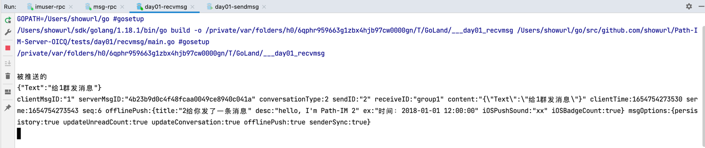

# 上一章：[编写msg-rpc](msg-rpc.md)

---

# 简单的测试

## 收消息

```go
url := fmt.Sprintf("%s?token=%s&userID=%s&platform=%s", WsAddr, Token, uid, Platform)
w, _, err = websocket.DefaultDialer.Dial(url, nil)
```

```go
package main

func main() {
	ws := Ws("1")
	for {
		typ, body, err := ws.ReadMessage()
		if err != nil {
			fmt.Printf("%v", err)
			return
		}
		if typ == websocket.BinaryMessage {
			bodyResp := &pb.BodyResp{}
			_ = proto.Unmarshal(body, bodyResp)
			switch bodyResp.ReqIdentifier {
			case types.WSPushMsg, types.WSGroupPushMsg:
				msgData := &chatpb.MsgData{}
				_ = proto.Unmarshal(bodyResp.Data, msgData)
				fmt.Printf(fmt.Sprintf(`
被推送的
%s
%s
`, string(msgData.Content), msgData.String()))

			}
		}
	}
}
```

> 报错：dial: unexpected EOF

### 修改msggateway-ws.yaml

```yaml
ImUserRpc:
  Endpoints:
    - 192.168.1.98:10011

MsgRpc:
  Endpoints:
    - 192.168.1.98:10012
```

### 修改msggateway-rpc.yaml

```yaml
ImUserRpc:
  Endpoints:
    - 192.168.1.98:10011
```

### 修改msgtransfer-history-cassandra.yaml

```yaml
ImUserRpc:
  Endpoints:
    - 192.168.1.98:10011
```

### 重启docker容器

```shell
docker restart server-msggateway-wsrpc-1
docker restart server-msgpush-rpc-1
```

### 再次尝试接收消息

> 报错：dial: websocket: bad handshake

### 修改imuser-rpc 编写verifyToken逻辑层代码

```go
//  检查token
func (l *VerifyTokenLogic) VerifyToken(in *pb.VerifyTokenReq) (*pb.VerifyTokenResp, error) {
// todo: add your logic here and delete this line

return &pb.VerifyTokenResp{
Uid:     in.SendID,
Success: true,
ErrMsg:  "",
}, nil
}
```

### 重启imuser-rpc

```shell
go run app/imuser/rpc/imuser.go
```

### 再次尝试接收消息

> 程序正常运行 等待其他人发送消息

## 发消息

```go
package main

func main() {
	Ws("2")
	buf, _ := json.Marshal(map[string]string{
		"Text": "给1群发消息",
	})
	SendMsyByMsgData(&chatpb.MsgData{
		ClientMsgID:      "1",
		ConversationType: types.GroupChatType,
		SendID:           "2",
		ReceiveID:        "group1",
		ContentType:      0,
		Content:          buf,
		AtUserIDList:     nil,
		OfflinePush: &chatpb.OfflinePush{
			Title:         "2给你发了一条消息",
			Desc:          "hello, I'm Path-IM 2",
			Ex:            "时间：2018-01-01 12:00:00",
			IOSPushSound:  "xx",
			IOSBadgeCount: true,
		},
		ClientTime: time.Now().UnixMilli(),
		ServerTime: 0,
		Seq:        0,
		MsgOptions: &chatpb.MsgOptions{
			Persistent:         true,
			History:            true,
			UpdateUnreadCount:  true,
			UpdateConversation: true,
		},
	})
}
```

> 收不到消息 原因是没有实现rpc接口 返回群聊成员列表

### 实现rpc接口

```go
//  获取群成员列表 通过消息接收选项
func (l *GetUserListFromGroupWithOptLogic) GetUserListFromGroupWithOpt(in *pb.GetUserListFromGroupWithOptReq) (*pb.GetUserListFromGroupWithOptResp, error) {
// todo: add your logic here and delete this line
var uidList []*pb.UserIDOpt
for i := 1; i <= 2000; i++ {
uidList = append(uidList, &pb.UserIDOpt{
UserID: strconv.Itoa(i),
Opts:   pb.RecvMsgOpt_ReceiveMessage,
})
}
for i := 2001; i <= 5000; i++ {
uidList = append(uidList, &pb.UserIDOpt{
UserID: strconv.Itoa(i),
Opts:   pb.RecvMsgOpt_ReceiveNotNotifyMessage,
})
}
for i := 5001; i <= 10000; i++ {
uidList = append(uidList, &pb.UserIDOpt{
UserID: strconv.Itoa(i),
Opts:   pb.RecvMsgOpt_NotReceiveMessage,
})
}
return &pb.GetUserListFromGroupWithOptResp{
CommonResp:    &pb.CommonResp{},
UserIDOptList: uidList,
}, nil
}

```

### 重启imuser-rpc

```shell
go run app/imuser/rpc/imuser.go
```

### 再次测试 成功



## FAQ

### panic: proto: file "chat.proto" is already registered

> 设置环境变量`GOLANG_PROTOBUF_REGISTRATION_CONFLICT`=`ignore`

---

# 下一章：[拆分服务](../day02/split-service.md)